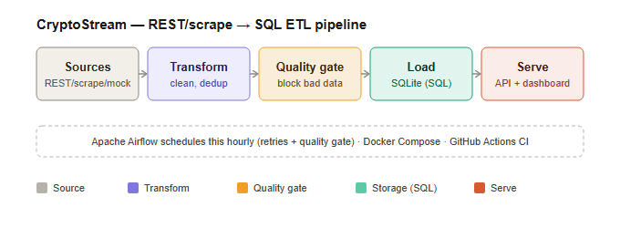

# CryptoStream — REST → SQL ETL Pipeline

[](https://github.com/mohamed-abo-taha/cryptostream-etl/actions/workflows/ci.yml)


A small but production-shaped **ETL pipeline** that ingests cryptocurrency
market data from a **REST API** (or by scraping HTML), transforms it with an
**OOP** design, validates it through a **data-quality gate**, stores it in a
**SQL** database, runs **analytical** queries, and **serves the result back out
over its own REST API** — scheduled by **Airflow** and visualised in **Streamlit**.

> Built to demonstrate the core Junior Data Engineer skills: data pipelines,
> ingestion, transformation, storage, OOP, SQL, REST APIs and analytical thinking.

### Architecture



### Live analytics output


---

## What it does (data flow)

```
 CoinGecko REST API ──HTTP/JSON──►  Extract  ──►  Transform  ──►  Load  ──►  SQLite
   (or offline sample)              (requests)    (clean/dedup)   (UPSERT)    warehouse
                                                                                │
                                                          Analytics (SQL)  ◄────┤
                                                          Flask REST API   ◄────┘
                                                                                │
                                                                  other systems ◄── HTTP/JSON
```

* **Extract** — pull the top-N coins from CoinGecko's `/coins/markets` endpoint
  (no API key). A `MockExtractor` replays a bundled JSON file so everything runs
  **fully offline**.
* **Transform** — normalise field names/types, upper-case tickers, coerce nulls,
  **validate** and **deduplicate**.
* **Load** — idempotent `UPSERT` into SQLite with a typed schema, `CHECK`
  constraints and indexes.
* **Analyse** — gainers/losers, market-cap tiers, dominance — all in SQL.
* **Serve** — a Flask REST API exposes the warehouse to downstream consumers.

## OOP design

Each ETL stage is an **abstract base class** (`Extractor`, `Transformer`,
`Loader` in [`src/base.py`](src/base.py)); concrete classes implement them and
are interchangeable. The `Pipeline` orchestrator
([`src/pipeline.py`](src/pipeline.py)) depends only on the abstractions, so you
can swap the REST source for the mock source, or SQLite for any other store,
without changing the orchestrator. This is dependency inversion in practice.

| Interface     | Implementations                              |
| ------------- | -------------------------------------------- |
| `Extractor`   | `RestExtractor`, `MockExtractor`             |
| `Transformer` | `CoinTransformer`                            |
| `Loader`      | `SQLiteLoader`                               |

## Project layout

```
project-1-cryptostream-etl/
├── config.py             # env-overridable settings
├── run_pipeline.py       # CLI: run ETL + print analytics report
├── run_api.py            # start the Flask REST API
├── src/
│   ├── models.py         # Coin domain model (OOP)
│   ├── base.py           # abstract Extractor / Transformer / Loader
│   ├── extract.py        # RestExtractor + MockExtractor
│   ├── transform.py      # cleaning, validation, dedup
│   ├── load.py           # SQLite schema + UPSERT
│   ├── analytics.py      # SQL analytics
│   └── api.py            # Flask REST API (application factory)
├── sample_data/coins_sample.json
└── tests/                # pytest suite (offline)
```

## Quick start

```bash
pip install -r requirements.txt

# 1) Run the pipeline offline (default) and print the analytics report
python run_pipeline.py --source mock --report

# 2) Or hit the live CoinGecko REST API (needs internet)
python run_pipeline.py --source rest --report

# 3) Serve the warehoused data over REST
python run_api.py
#   then in another shell:
#   curl http://127.0.0.1:5000/coins?limit=5&sort=change_24h_pct
#   curl http://127.0.0.1:5000/coins/BTC
#   curl http://127.0.0.1:5000/analytics/summary
```

## REST API reference

| Method & path             | Description                          |
| ------------------------- | ------------------------------------ |
| `GET /health`             | liveness probe                       |
| `GET /coins?limit=&sort=` | list coins (sortable, paged)         |
| `GET /coins/<symbol>`     | one coin by ticker (e.g. `BTC`)      |
| `GET /analytics/summary`  | market overview (aggregate SQL)      |
| `GET /analytics/movers`   | top gainers & losers                 |

`sort` is validated against a whitelist, and every query uses **parameterised
statements** — no string-formatted SQL, no injection.

## Advanced features

Beyond the core ETL, this project includes production-grade extras:

| Feature | How to use it | File(s) |
| ------- | ------------- | ------- |
| **Three ingestion sources** | `--source mock` / `rest` / `scrape` | `src/extract.py`, `src/scrape.py` |
| **Web scraping** | `--source scrape` parses an HTML price table with BeautifulSoup | `src/scrape.py` |
| **Data-quality gate** | runs automatically; blocks the load if error-severity checks fail; writes `data/quality_report.json` | `src/quality.py` |
| **Apache Airflow** | scheduled hourly DAG with retries + quality gate | `airflow/` |
| **Streamlit dashboard** | `streamlit run dashboard.py` | `dashboard.py` |
| **Docker** | `docker compose up -d --build` → API + dashboard | `Dockerfile`, `docker-compose.yml` |

The quality gate is the headline: the pipeline extracts and transforms, then a
`QualitySuite` of declarative rules (not-null, range, uniqueness, row-count)
inspects the batch. `error`-severity failures abort the load; `warning`s are
reported but don't block. See [`airflow/README.md`](airflow/README.md) for the
orchestration story.

## Tests

```bash
python -m pytest -q     # 15 passing: transform, validation/dedup, pipeline,
                        # analytics, quality framework, web scraping
```
